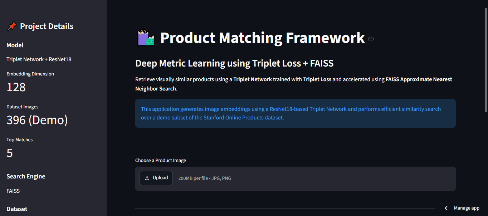
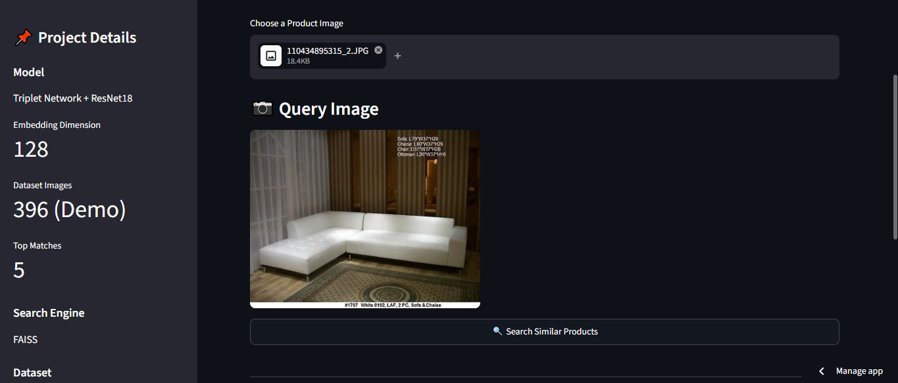

# 🛍️ Product Matching Framework using Triplet Loss Metric Learning

A Deep Metric Learning based Product Image Retrieval System that retrieves visually similar products using a **Triplet Network (VGG16 Backbone)** and **FAISS Approximate Nearest Neighbor Search**.

---

## 📌 Overview

Searching for visually similar products is one of the most important tasks in modern e-commerce platforms. Traditional image classification models identify the category of an object but are unable to retrieve products that look similar.

This project solves this problem using **Deep Metric Learning** with **Triplet Loss**, where visually similar products are mapped closer together in an embedding space while dissimilar products are pushed farther apart.

The generated embeddings are indexed using **FAISS**, enabling extremely fast similarity search over **139,521 product images** from the Stanford Online Products Dataset.

---

# 🚀 Features

- Deep Metric Learning using Triplet Loss
- VGG16 Backbone
- 128-Dimensional Image Embeddings
- FAISS Similarity Search
- Product Image Retrieval
- Streamlit Web Interface
- CPU & GPU Compatible
- Batch Embedding Generation
- Duplicate Result Removal
- Professional User Interface

---

# 📂 Project Structure

```
Product_Matching_Framework
│
├── app/
│   └── streamlit_app.py
│
├── data/
│
├── dataset/
│
├── embeddings/
│   └── merged/
│       ├── embeddings.npy
│       ├── faiss.index
│       └── image_paths.pkl
│
├── inference/
│   └── search.py
│
├── models/
│   └── embedding_network.py
│
├── saved_models/
│   └── triplet_model.pth
│
├── training/
│   ├── generate_embeddings.py
│   ├── merge_embeddings.py
│   └── build_faiss.py
│
├── assets/
│
├── requirements.txt
│
└── README.md
```

---

# 🏗️ System Architecture

```
                Query Image
                     │
                     ▼
           Image Preprocessing
                     │
                     ▼
         Triplet Network (VGG16)
                     │
                     ▼
          128-D Feature Vector
                     │
                     ▼
            FAISS Similarity Search
                     │
                     ▼
         Top-5 Similar Product Images
                     │
                     ▼
              Streamlit Interface
```

---

# ⚙️ Workflow

1. Load the trained Triplet Network.
2. Preprocess the uploaded image.
3. Generate a 128-dimensional embedding.
4. Normalize the embedding.
5. Search the FAISS index.
6. Remove duplicate results.
7. Display the Top-5 visually similar products.

---

# 🧠 Model Details

| Component | Description |
|-----------|-------------|
| Backbone | VGG16 |
| Loss Function | Triplet Loss |
| Embedding Dimension | 128 |
| Framework | PyTorch |
| Similarity Search | FAISS |
| Dataset | Stanford Online Products |

---

# 📊 Dataset Information

**Dataset Name**

Stanford Online Products Dataset

**Total Images**

139,521

**Product Categories**

22,634

**Image Size**

224 × 224

---

# 💻 Technology Stack

- Python
- PyTorch
- Torchvision
- FAISS
- NumPy
- Pillow
- Streamlit
- tqdm

---

# 📸 Application Screenshots

## 🏠 Home Page



---

## 📤 Upload Query Image



---

## 🥇 Match 1


---

## 🥈 Match 2


---

## 🥉 Match 3


---

## 🏅 Match 4


---

## 🏅 Match 5


---

# 🔍 Retrieval Pipeline

```
Input Image
      │
      ▼
Image Transform
      │
      ▼
Triplet Network
      │
      ▼
Embedding Generation
      │
      ▼
FAISS Search
      │
      ▼
Top-5 Similar Images
```

---

# 📈 Performance

| Parameter | Value |
|-----------|-------|
| Dataset Size | 139,521 Images |
| Embedding Size | 128 |
| Model Size | ~46 MB |
| Search Engine | FAISS |
| Retrieval Time | < 1 Second (Typical, hardware dependent) |
| Results Displayed | Top-5 |

---

# ▶️ Installation

Clone the repository

```bash
git clone https://github.com/<arpitaj113>/Product_Matching_Framework.git
```

Move into the project

```bash
cd Product_Matching_Framework
```

Install dependencies

```bash
pip install -r requirements.txt
```

---

# ▶️ Running the Application

```bash
streamlit run app/streamlit_app.py
```

---

# 📷 Usage

1. Launch the application.
2. Upload a product image.
3. Click **Search Similar Products**.
4. The application generates the query embedding.
5. FAISS retrieves the nearest embeddings.
6. The Top-5 visually similar products are displayed.

---

# 📌 Future Improvements

- Multi-modal Image + Text Search
- CLIP-based Embeddings
- Category-wise Filtering
- Online Index Updates
- Cloud Deployment
- Mobile Application
- Product Recommendation Integration

---

# 🎯 Applications

- E-commerce Product Search
- Visual Similarity Search
- Fashion Recommendation
- Furniture Recommendation
- Product Catalog Matching
- Duplicate Product Detection

---

# 👩‍💻 Authors

- **Arpita Jaiswal**
- **Simran Manhas**
- **Divya Prakash Verma**

---

**Project Developed at:**

Centre for Development of Advanced Computing (C-DAC), Mohali
---

# 🙏 Acknowledgements

- Stanford Online Products Dataset
- PyTorch
- FAISS
- Streamlit

---

# ⭐ If you found this project useful, consider giving it a Star!
